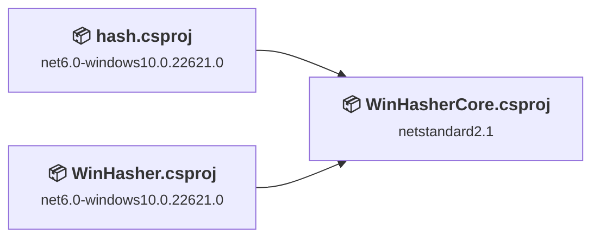
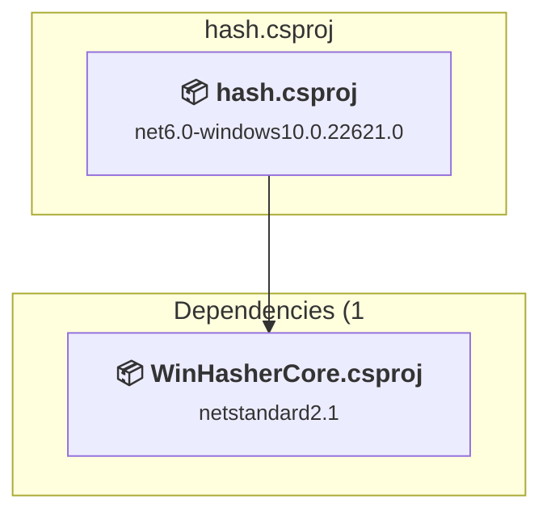
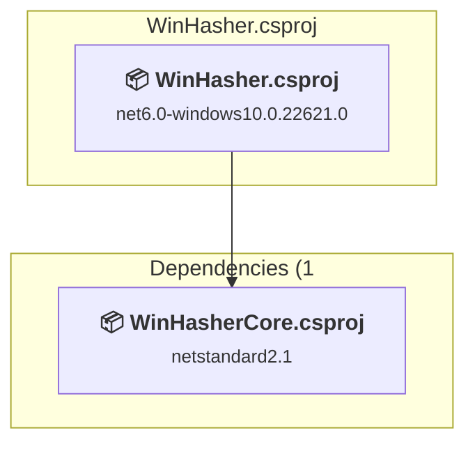
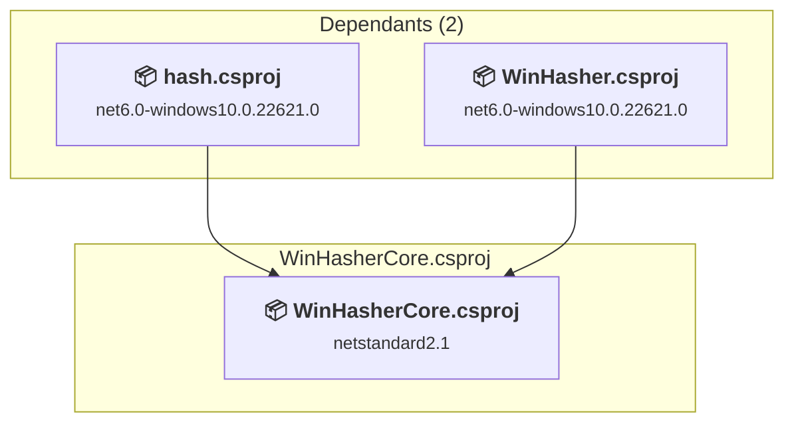

# Projects and dependencies analysis

This document provides a comprehensive overview of the projects and their dependencies in the context of upgrading to .NETCoreApp,Version=v10.0.

## Table of Contents

- [Executive Summary](#executive-Summary)
  - [Highlevel Metrics](#highlevel-metrics)
  - [Projects Compatibility](#projects-compatibility)
  - [Package Compatibility](#package-compatibility)
  - [API Compatibility](#api-compatibility)
  - [Binding Redirect Configuration](#binding-redirect-configuration)
- [Aggregate NuGet packages details](#aggregate-nuget-packages-details)
- [Top API Migration Challenges](#top-api-migration-challenges)
  - [Technologies and Features](#technologies-and-features)
  - [Most Frequent API Issues](#most-frequent-api-issues)
- [Projects Relationship Graph](#projects-relationship-graph)
- [Project Details](#project-details)

  - [hash\hash.csproj](#hashhashcsproj)
  - [WinHasher\WinHasher.csproj](#winhasherwinhashercsproj)
  - [WinHasherCore\WinHasherCore.csproj](#winhashercorewinhashercorecsproj)

## Executive Summary

### Highlevel Metrics

| Metric | Count | Status |
| :--- | :---: | :--- |
| Total Projects | 3 | 2 require upgrade |
| Total NuGet Packages | 1 | All compatible |
| Total Code Files | 18 |  |
| Total Code Files with Incidents | 11 |  |
| Total Lines of Code | 4833 |  |
| Total Number of Issues | 2429 |  |
| Estimated LOC to modify | 2427+ | at least 50.2% of codebase |

### Projects Compatibility

| Project | Target Framework | Difficulty | Package Issues | API Issues | Binding Issues | Est. LOC Impact | Description |
| :--- | :---: | :---: | :---: | :---: | :---: | :---: | :--- |
| [hash\hash.csproj](#hashhashcsproj) | net6.0-windows10.0.22621.0 | 🟢 Low | 0 | 0 | 0 |  | DotNetCoreApp, Sdk Style = True |
| [WinHasher\WinHasher.csproj](#winhasherwinhashercsproj) | net6.0-windows10.0.22621.0 | 🟡 Medium | 0 | 2427 | 0 | 2427+ | WinForms, Sdk Style = True |
| [WinHasherCore\WinHasherCore.csproj](#winhashercorewinhashercorecsproj) | netstandard2.1 | ✅ None | 0 | 0 | 0 |  | ClassLibrary, Sdk Style = True |

### Package Compatibility

| Status | Count | Percentage |
| :--- | :---: | :---: |
| ✅ Compatible | 1 | 100.0% |
| ⚠️ Incompatible | 0 | 0.0% |
| 🔄 Upgrade Recommended | 0 | 0.0% |
| ***Total NuGet Packages*** | ***1*** | ***100%*** |

### API Compatibility

| Category | Count | Impact |
| :--- | :---: | :--- |
| 🔴 Binary Incompatible | 2403 | High - Require code changes |
| 🟡 Source Incompatible | 24 | Medium - Needs re-compilation and potential conflicting API error fixing |
| 🔵 Behavioral change | 0 | Low - Behavioral changes that may require testing at runtime |
| ✅ Compatible | 2336 |  |
| ***Total APIs Analyzed*** | ***4763*** |  |

## Aggregate NuGet packages details

| Package | Current Version | Suggested Version | Projects | Description |
| :--- | :---: | :---: | :--- | :--- |
| BouncyCastle.Cryptography | 2.3.1 |  | [hash.csproj](#hashhashcsproj) [WinHasher.csproj](#winhasherwinhashercsproj) [WinHasherCore.csproj](#winhashercorewinhashercorecsproj) | ✅Compatible |

## Top API Migration Challenges

### Technologies and Features

| Technology | Issues | Percentage | Migration Path |
| :--- | :---: | :---: | :--- |
| Windows Forms | 2403 | 99.0% | Windows Forms APIs for building Windows desktop applications with traditional Forms-based UI that are available in .NET on Windows. Enable Windows Desktop support: Option 1 (Recommended): Target net9.0-windows; Option 2: Add <UseWindowsDesktop>true</UseWindowsDesktop>; Option 3 (Legacy): Use Microsoft.NET.Sdk.WindowsDesktop SDK. |
| GDI+ / System.Drawing | 24 | 1.0% | System.Drawing APIs for 2D graphics, imaging, and printing that are available via NuGet package System.Drawing.Common. Note: Not recommended for server scenarios due to Windows dependencies; consider cross-platform alternatives like SkiaSharp or ImageSharp for new code. |

### Most Frequent API Issues

| API | Count | Percentage | Category |
| :--- | :---: | :---: | :--- |
| T:System.Windows.Forms.Button | 198 | 8.2% | Binary Incompatible |
| T:System.Windows.Forms.Label | 178 | 7.3% | Binary Incompatible |
| T:System.Windows.Forms.TextBox | 158 | 6.5% | Binary Incompatible |
| T:System.Windows.Forms.MessageBoxIcon | 100 | 4.1% | Binary Incompatible |
| T:System.Windows.Forms.MessageBoxButtons | 100 | 4.1% | Binary Incompatible |
| T:System.Windows.Forms.TabPage | 78 | 3.2% | Binary Incompatible |
| T:System.Windows.Forms.DialogResult | 76 | 3.1% | Binary Incompatible |
| P:System.Windows.Forms.TextBox.Text | 68 | 2.8% | Binary Incompatible |
| T:System.Windows.Forms.ComboBox | 60 | 2.5% | Binary Incompatible |
| P:System.Windows.Forms.Control.Name | 51 | 2.1% | Binary Incompatible |
| T:System.Windows.Forms.MessageBox | 50 | 2.1% | Binary Incompatible |
| M:System.Windows.Forms.MessageBox.Show(System.String,System.String,System.Windows.Forms.MessageBoxButtons,System.Windows.Forms.MessageBoxIcon) | 50 | 2.1% | Binary Incompatible |
| F:System.Windows.Forms.MessageBoxButtons.OK | 49 | 2.0% | Binary Incompatible |
| T:System.Windows.Forms.Control.ControlCollection | 47 | 1.9% | Binary Incompatible |
| P:System.Windows.Forms.Control.Controls | 47 | 1.9% | Binary Incompatible |
| M:System.Windows.Forms.Control.ControlCollection.Add(System.Windows.Forms.Control) | 47 | 1.9% | Binary Incompatible |
| P:System.Windows.Forms.Control.Size | 47 | 1.9% | Binary Incompatible |
| T:System.Windows.Forms.ToolTip | 45 | 1.9% | Binary Incompatible |
| P:System.Windows.Forms.Control.TabIndex | 44 | 1.8% | Binary Incompatible |
| P:System.Windows.Forms.Control.Location | 44 | 1.8% | Binary Incompatible |
| F:System.Windows.Forms.MessageBoxIcon.Error | 43 | 1.8% | Binary Incompatible |
| T:System.Windows.Forms.ListBox | 33 | 1.4% | Binary Incompatible |
| P:System.Windows.Forms.Control.Enabled | 30 | 1.2% | Binary Incompatible |
| M:System.Windows.Forms.ToolTip.SetToolTip(System.Windows.Forms.Control,System.String) | 28 | 1.2% | Binary Incompatible |
| P:System.Windows.Forms.Label.Text | 25 | 1.0% | Binary Incompatible |
| T:System.Windows.Forms.DragEventHandler | 24 | 1.0% | Binary Incompatible |
| T:System.Windows.Forms.TabControl | 23 | 0.9% | Binary Incompatible |
| T:System.Windows.Forms.CheckBox | 22 | 0.9% | Binary Incompatible |
| T:System.Windows.Forms.FormStartPosition | 16 | 0.7% | Binary Incompatible |
| T:System.Windows.Forms.LinkLabel | 15 | 0.6% | Binary Incompatible |
| T:System.Drawing.ContentAlignment | 15 | 0.6% | Source Incompatible |
| M:System.Windows.Forms.Label.#ctor | 15 | 0.6% | Binary Incompatible |
| P:System.Windows.Forms.ButtonBase.UseVisualStyleBackColor | 14 | 0.6% | Binary Incompatible |
| P:System.Windows.Forms.ButtonBase.Text | 14 | 0.6% | Binary Incompatible |
| E:System.Windows.Forms.Control.Click | 13 | 0.5% | Binary Incompatible |
| M:System.Windows.Forms.Button.#ctor | 13 | 0.5% | Binary Incompatible |
| T:System.Windows.Forms.FormBorderStyle | 12 | 0.5% | Binary Incompatible |
| T:System.Windows.Forms.AutoScaleMode | 12 | 0.5% | Binary Incompatible |
| P:System.Windows.Forms.ComboBox.SelectedItem | 12 | 0.5% | Binary Incompatible |
| T:System.Windows.Forms.ListBox.ObjectCollection | 12 | 0.5% | Binary Incompatible |
| P:System.Windows.Forms.ListBox.Items | 12 | 0.5% | Binary Incompatible |
| P:System.Windows.Forms.Label.AutoSize | 11 | 0.5% | Binary Incompatible |
| T:System.Windows.Forms.ComboBox.ObjectCollection | 11 | 0.5% | Binary Incompatible |
| P:System.Windows.Forms.ComboBox.Items | 11 | 0.5% | Binary Incompatible |
| T:System.Windows.Forms.ProgressBar | 11 | 0.5% | Binary Incompatible |
| T:System.Windows.Forms.IButtonControl | 10 | 0.4% | Binary Incompatible |
| T:System.Windows.Forms.ComboBoxStyle | 9 | 0.4% | Binary Incompatible |
| M:System.Windows.Forms.Form.#ctor | 8 | 0.3% | Binary Incompatible |
| M:System.Windows.Forms.Control.ResumeLayout(System.Boolean) | 8 | 0.3% | Binary Incompatible |
| M:System.Windows.Forms.Control.SuspendLayout | 8 | 0.3% | Binary Incompatible |

## Projects Relationship Graph

Legend:
📦 SDK-style project
⚙️ Classic project

## Project Details

### hash\hash.csproj

#### Project Info

- **Current Target Framework:** net6.0-windows10.0.22621.0
- **Proposed Target Framework:** net10.0--windows10.0.22621.0
- **SDK-style**: True
- **Project Kind:** DotNetCoreApp
- **Dependencies**: 1
- **Dependants**: 0
- **Number of Files**: 3
- **Number of Files with Incidents**: 1
- **Lines of Code**: 209
- **Estimated LOC to modify**: 0+ (at least 0.0% of the project)

#### Dependency Graph

Legend:
📦 SDK-style project
⚙️ Classic project

### API Compatibility

| Category | Count | Impact |
| :--- | :---: | :--- |
| 🔴 Binary Incompatible | 0 | High - Require code changes |
| 🟡 Source Incompatible | 0 | Medium - Needs re-compilation and potential conflicting API error fixing |
| 🔵 Behavioral change | 0 | Low - Behavioral changes that may require testing at runtime |
| ✅ Compatible | 32 |  |
| ***Total APIs Analyzed*** | ***32*** |  |

### WinHasher\WinHasher.csproj

#### Project Info

- **Current Target Framework:** net6.0-windows10.0.22621.0
- **Proposed Target Framework:** net10.0-windows
- **SDK-style**: True
- **Project Kind:** WinForms
- **Dependencies**: 1
- **Dependants**: 0
- **Number of Files**: 17
- **Number of Files with Incidents**: 10
- **Lines of Code**: 3137
- **Estimated LOC to modify**: 2427+ (at least 77.4% of the project)

#### Dependency Graph

Legend:
📦 SDK-style project
⚙️ Classic project

### API Compatibility

| Category | Count | Impact |
| :--- | :---: | :--- |
| 🔴 Binary Incompatible | 2403 | High - Require code changes |
| 🟡 Source Incompatible | 24 | Medium - Needs re-compilation and potential conflicting API error fixing |
| 🔵 Behavioral change | 0 | Low - Behavioral changes that may require testing at runtime |
| ✅ Compatible | 1807 |  |
| ***Total APIs Analyzed*** | ***4234*** |  |

#### Project Technologies and Features

| Technology | Issues | Percentage | Migration Path |
| :--- | :---: | :---: | :--- |
| GDI+ / System.Drawing | 24 | 1.0% | System.Drawing APIs for 2D graphics, imaging, and printing that are available via NuGet package System.Drawing.Common. Note: Not recommended for server scenarios due to Windows dependencies; consider cross-platform alternatives like SkiaSharp or ImageSharp for new code. |
| Windows Forms | 2403 | 99.0% | Windows Forms APIs for building Windows desktop applications with traditional Forms-based UI that are available in .NET on Windows. Enable Windows Desktop support: Option 1 (Recommended): Target net9.0-windows; Option 2: Add <UseWindowsDesktop>true</UseWindowsDesktop>; Option 3 (Legacy): Use Microsoft.NET.Sdk.WindowsDesktop SDK. |

### WinHasherCore\WinHasherCore.csproj

#### Project Info

- **Current Target Framework:** netstandard2.1✅
- **SDK-style**: True
- **Project Kind:** ClassLibrary
- **Dependencies**: 0
- **Dependants**: 2
- **Number of Files**: 6
- **Lines of Code**: 1487
- **Estimated LOC to modify**: 0+ (at least 0.0% of the project)

#### Dependency Graph

Legend:
📦 SDK-style project
⚙️ Classic project

### API Compatibility

| Category | Count | Impact |
| :--- | :---: | :--- |
| 🔴 Binary Incompatible | 0 | High - Require code changes |
| 🟡 Source Incompatible | 0 | Medium - Needs re-compilation and potential conflicting API error fixing |
| 🔵 Behavioral change | 0 | Low - Behavioral changes that may require testing at runtime |
| ✅ Compatible | 497 |  |
| ***Total APIs Analyzed*** | ***497*** |  |

